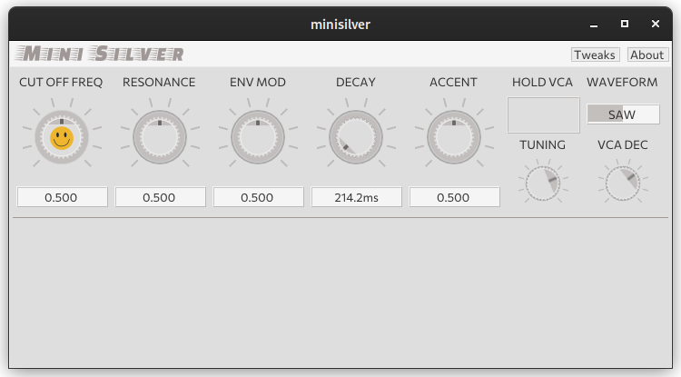

# DPF + ImGui template plugin project

> :warning: You're on the directaccess branch!
>
> This branch shows how to use direct access to the Plugin instance from the GUI, code refactored into separate .hpp/.cpp  
> :rotating_light: **No realtime and access safety, bring your own!**



This repository contains an example audio plugin project using DPF and ImGui.

`git clone --recursive https://github.com/Simon-L/imgui-template-plugin my-cool-plugin`

## Placeholders

* `__CMAKENAME__`: used in CMakeLists.txt
* `__DPFLABEL__`: restricted, short, _, a-z, A-Z and 0-9
* `__DPFURI__`: LV2 plugin uri `urn:like:this`
* `__DPFDESCRIPTION__`: can contain spaces
* `__YOURNAME__`: can contain spaces
* `__IMGUINAME__`: label in the imgui header, can contain spaces

## Building

```bash
cmake -Bbuild
cmake --build build
# optionally cmake --build build --parallel 16
```
